# Arquitetura Hub-Spoke Analítica no Google Cloud

## Sumário

1. [Contexto e Motivação](#contexto-e-motivação)
2. [A Evolução: Três Mundos](#a-evolução-três-mundos)
   - [Mundo 1 — Data Lake Centralizado](#mundo-1--data-lake-centralizado)
   - [Mundo 2 — Data Mesh Distribuído](#mundo-2--data-mesh-distribuído)
   - [Mundo 3 — Hub-Spoke: O Melhor dos Dois Mundos](#mundo-3--hub-spoke-o-melhor-dos-dois-mundos)
3. [Arquitetura Hub-Spoke](#arquitetura-hub-spoke)
   - [O Hub](#o-hub)
   - [Os Spokes](#os-spokes)
   - [A Equipe de Plataforma de Dados](#a-equipe-de-plataforma-de-dados)
4. [O Impacto do Mundo Agêntico nos Spokes](#o-impacto-do-mundo-agêntico-nos-spokes)
5. [Stack Tecnológica](#stack-tecnológica)
6. [Fluxo de Dados](#fluxo-de-dados)
7. [Publicação de Produtos de Dados](#publicação-de-produtos-de-dados)
8. [Modelo de Governança](#modelo-de-governança)
9. [Modelo de Custos](#modelo-de-custos)
10. [Migração Incremental](#migração-incremental)
11. [Benefícios](#benefícios)

---

## Contexto e Motivação

A gestão e o processamento de dados analíticos evoluíram significativamente ao longo dos últimos anos. Cada fase trouxe avanços, mas também trouxe desafios que precisaram ser resolvidos na fase seguinte. A arquitetura **Hub-Spoke Analítica** é o resultado dessa jornada: uma abordagem que centraliza o que deve ser centralizado — governança, gestão e publicação de produtos de dados — e distribui o que deve ser distribuído — o domínio do conhecimento do negócio.

Assim como na arquitetura de redes, onde o modelo hub-spoke conecta filiais (spokes) a um núcleo central (hub) mantendo autonomia local com conectividade centralizada, aqui aplicamos o mesmo princípio ao mundo analítico no Google Cloud.

---

## A Evolução: Três Mundos

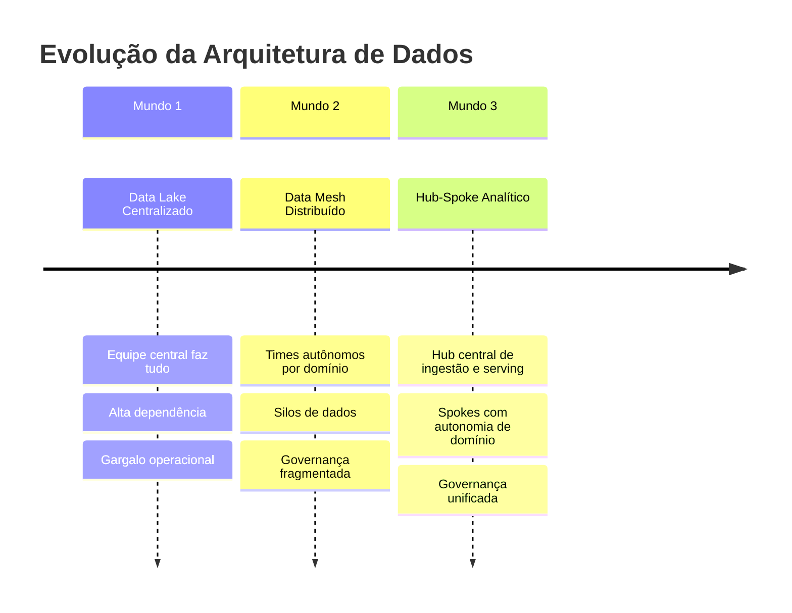

### Mundo 1 — Data Lake Centralizado

No modelo original, toda a cadeia analítica era responsabilidade de uma única equipe de engenharia de dados. Desde a ingestão de fontes até a entrega de produtos analíticos para consumo, tudo passava por esse time central.

**Características:**
- Pipeline de dados de ponta a ponta gerenciado por um único time
- Conhecimento técnico concentrado, mas conhecimento de negócio disperso
- Qualquer nova fonte ou transformação dependia de alocação da equipe central
- Priorização centralizada, desalinhada com a velocidade dos domínios de negócio

**Problemas gerados:**

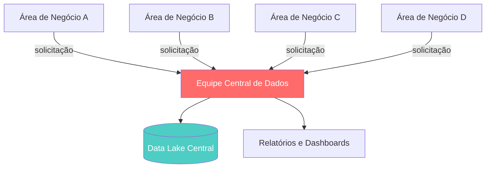

> A equipe central virava um gargalo. Toda inteligência de negócio precisava ser traduzida e reaprendida por engenheiros que não viviam aquele domínio.

---

### Mundo 2 — Data Mesh Distribuído

Para resolver o gargalo da centralização, adotou-se o modelo de **Data Mesh**: cada domínio de negócio passou a ser dono dos seus próprios dados, responsável pela ingestão, transformação e publicação.

**Características:**
- Times de domínio autônomos, com engenheiros próprios de dados
- Cada domínio operava seu próprio projeto GCP, pipelines e datasets
- Aproximação do conhecimento técnico com o conhecimento de negócio

**Problemas gerados:**

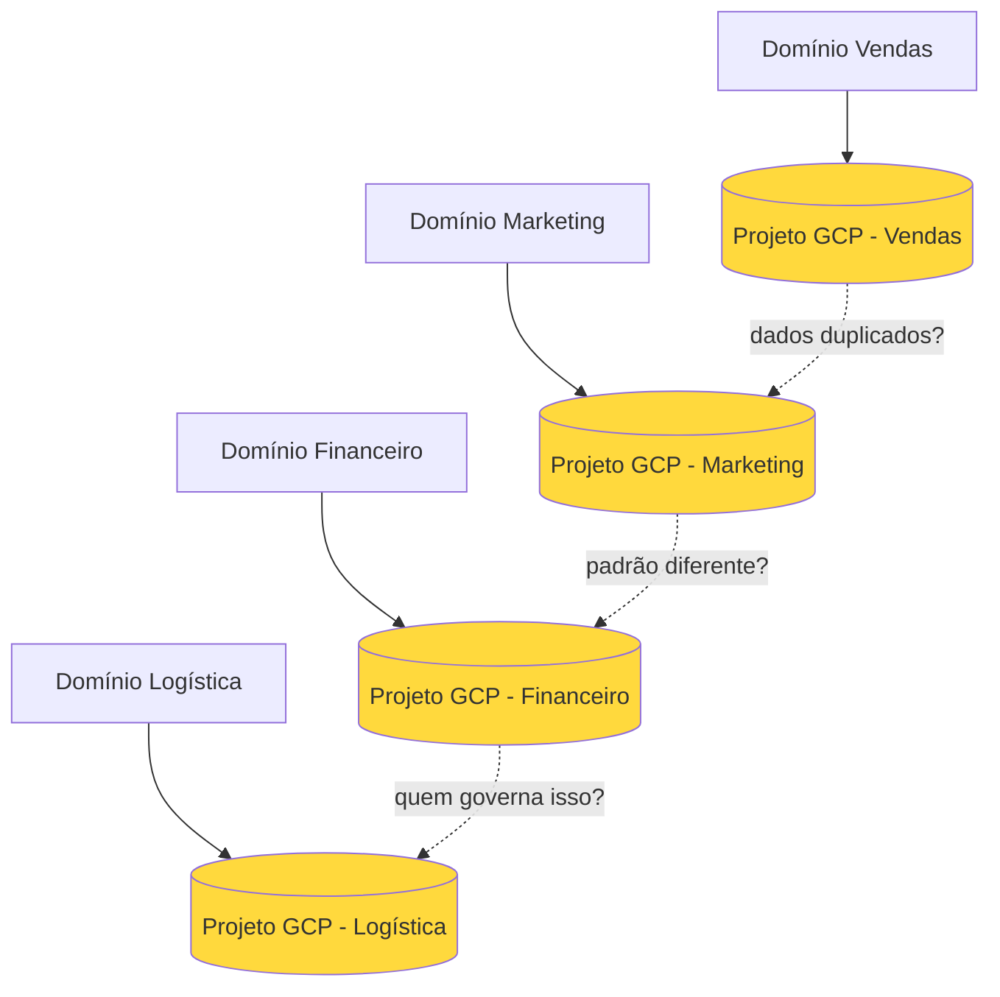

| Problema | Impacto |
|---|---|
| **Silos de dados** | Dados duplicados e inconsistentes entre domínios |
| **Governança fragmentada** | Sem padrão de qualidade, linhagem ou catálogo unificado |
| **Descoberta impossível** | Consumidores não sabiam o que existia ou onde encontrar |
| **Custo descontrolado** | Duplicação de infraestrutura, sem visibilidade consolidada |
| **Segurança inconsistente** | Cada projeto com políticas de IAM diferentes e ad hoc |

> O Data Mesh resolveu o gargalo humano, mas criou um caos de governança. A autonomia sem estrutura virou anarquia de dados.

---

### Mundo 3 — Hub-Spoke: O Melhor dos Dois Mundos

A arquitetura Hub-Spoke Analítica combina a **autonomia do Data Mesh** com a **governança e visibilidade do modelo centralizado**. O hub não é um gargalo operacional — ele é uma plataforma de serviços que os spokes consomem e contribuem.

**Princípio central:**
> Centralizar o que é plataforma. Distribuir o que é domínio.

---

## Arquitetura Hub-Spoke

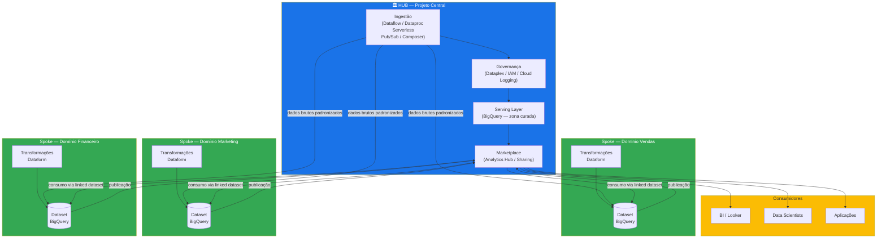

### O Hub

O Hub é o **projeto GCP central** que provê serviços de plataforma para todos os spokes. Ele **não** é o dono dos dados de domínio — ele é o dono da infraestrutura de ingestão, do padrão de qualidade e do canal de publicação.

**Responsabilidades do Hub:**

| Camada | Serviço GCP | Responsabilidade |
|---|---|---|
| **Ingestão** | Dataflow / Dataproc Serverless | Pipelines padronizados de ingestão batch e streaming |
| **Orquestração** | Cloud Composer | Scheduling e dependências entre pipelines |
| **Mensageria** | Pub/Sub | Ingestão de eventos em tempo real |
| **Governança** | Dataplex | Catálogo, qualidade de dados, linhagem, zonas de dados |
| **Controle de Acesso** | IAM | Políticas centralizadas e auditadas |
| **Observabilidade** | Cloud Logging | Logs centralizados, alertas, auditoria |
| **Publicação** | Analytics Hub (Sharing) | Marketplace interno de produtos de dados |

### Os Spokes

Os Spokes são os **projetos GCP de domínio ou área de negócio**. Cada spoke é dono do conhecimento e da lógica do seu domínio — ele consome dados brutos fornecidos pelo hub, produz produtos de dados certificados, e também **consome produtos de dados publicados por outros spokes** via marketplace.

> Os spokes são simultaneamente publicadores e consumidores do Analytics Hub. Um domínio de Marketing pode consumir dados certificados do domínio de Vendas sem qualquer integração direta entre os projetos — tudo mediado pelo marketplace.

**Responsabilidades dos Spokes:**

| Atividade | Serviço GCP | Responsabilidade |
|---|---|---|
| **Transformação** | Dataform | Modelos SQL, testes de qualidade, documentação de linhagem |
| **Armazenamento** | BigQuery | Datasets do domínio (raw, trusted, refined) |
| **Publicação** | Analytics Hub (via Hub) | Publicação dos produtos de dados no marketplace |
| **Consumo** | Analytics Hub (via Hub) | Subscrição a produtos de dados de outros domínios |

**O que os spokes NÃO fazem:**
- Criar pipelines de ingestão próprios fora do padrão
- Definir políticas de IAM de forma independente
- Publicar dados sem passar pelo catálogo Dataplex

### A Equipe de Plataforma de Dados

A antiga **equipe central de engenharia de dados** — que no modelo do Data Lake fazia tudo, e no Data Mesh ficou sem papel claro — se transforma na **equipe de Plataforma de Dados**.

Essa mudança não é apenas de nome: é uma mudança de missão.

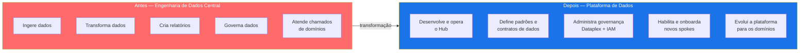

| Antes (Engenharia Central) | Depois (Plataforma de Dados) |
|---|---|
| Executa pipelines de domínios | Provê a infraestrutura de pipelines |
| Faz as transformações do negócio | Define os padrões que os domínios seguem |
| Atende requisições dos times | Habilita times a serem autônomos |
| Gargalo de entrega | Multiplicador de capacidade analítica |
| Conhecimento disperso em domínios | Foco em engenharia de plataforma e governança |

> A equipe de Plataforma de Dados não é mais um prestador de serviços de análise — é a equipe responsável por construir e operar a infraestrutura que torna todos os outros times de dados mais rápidos e confiáveis.

### Princípio: Automação em Primeiro Lugar

A equipe de Plataforma de Dados deve operar com uma mentalidade de **automação máxima** — qualquer tarefa repetitiva ou previsível deve ser automatizada antes de se tornar um processo manual recorrente. O trabalho manual é o inimigo da escala.

> Se um processo requer intervenção manual recorrente da equipe de plataforma, ele precisa ser automatizado. O objetivo é que a plataforma opere e escale **sem crescimento proporcional da equipe**.

**Ingestão totalmente automatizada:**

Dado que o número de fontes e origens de dados é finito e conhecido, não há justificativa para pipelines de ingestão criados manualmente caso a caso. A plataforma deve oferecer um modelo de **self-service de ingestão**: o spoke solicita a conexão a uma nova fonte, a plataforma provisiona e monitora o pipeline automaticamente — sem envolvimento operacional da equipe de plataforma.

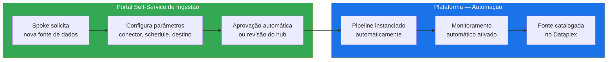

| Tipo de tarefa | Abordagem correta |
|---|---|
| **Ingestão de nova fonte** | Self-service: spoke configura, plataforma automatiza |
| **Onboarding de novo spoke** | Templates IaC parametrizáveis, sem configuração manual |
| **Monitoramento de pipelines** | Alertas automáticos, sem plantão ou verificação manual |
| **Qualidade de dados** | Regras executadas automaticamente pelo Dataplex |
| **Publicação no marketplace** | Fluxo automatizado pós-certificação do Dataplex |
| **Provisionamento de acesso** | Self-service via IAM com políticas pré-aprovadas por perfil |

---

## O Impacto do Mundo Agêntico nos Spokes

Uma das transformações mais significativas que a arquitetura Hub-Spoke habilita é o aproveitamento de **agentes de IA** no trabalho analítico dos domínios. Com o hub garantindo a infraestrutura, os dados brutos padronizados e a governança, os times dos spokes podem focar exclusivamente no conhecimento do negócio — e deixar que agentes gerem o código técnico.

**O que muda para as equipes de domínio:**

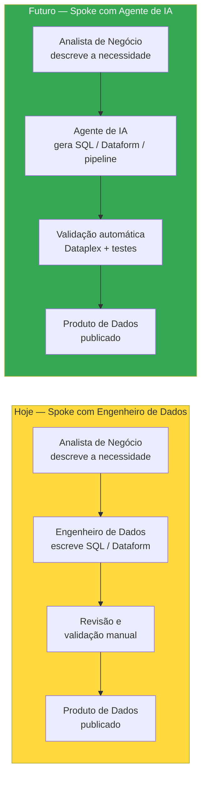

**Implicações práticas:**

| Dimensão | Impacto |
|---|---|
| **SQL e Spark** | Equipes de domínio não precisam mais de conhecimento técnico em SQL ou Spark — o agente escreve, testa e documenta |
| **Autonomia ampliada** | O domínio ganha ainda mais velocidade: o analista que entende o negócio se torna o produtor direto do produto de dados |
| **Papel do hub** | O hub se torna ainda mais crítico: é ele que provê o contexto (metadados, esquemas, linhagem) que alimenta os agentes com precisão |
| **Qualidade** | As validações automáticas do Dataplex funcionam como o "compilador" que verifica o que o agente gerou antes de publicar |
| **Governança** | Mais importante do que nunca — agentes geram código rapidamente, mas precisam de guardrails claros de qualidade e acesso |

> No mundo agêntico, o hub não apenas suporta os spokes — ele os **potencializa**. A infraestrutura padronizada e os metadados ricos do Dataplex são exatamente o contexto que os agentes precisam para gerar transformações corretas sem supervisão técnica constante.

---

## Stack Tecnológica

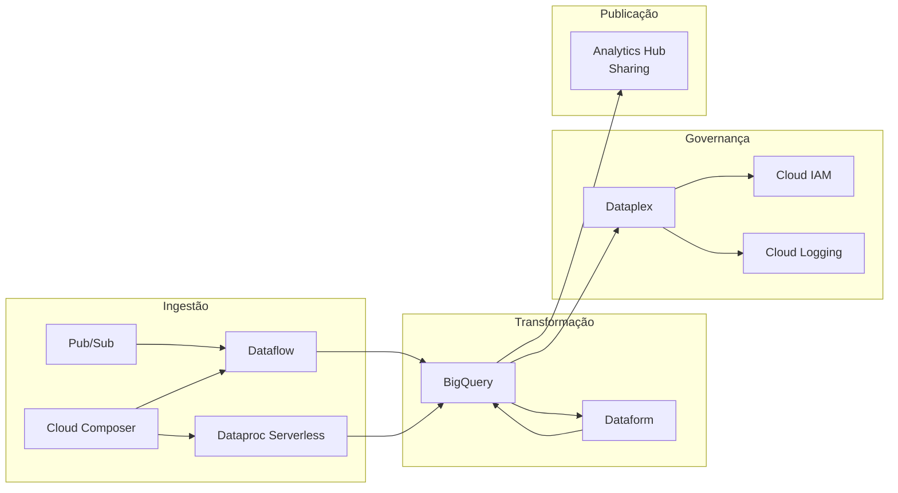

| Serviço | Papel na Arquitetura |
|---|---|
| **Pub/Sub** | Ingestão de eventos em streaming; desacopla produtores de consumidores |
| **Dataflow** | Processamento de dados em streaming e batch; pipelines gerenciados |
| **Dataproc Serverless** | Processamento Spark serverless para jobs de ingestão e transformação pesados |
| **Cloud Composer** | Orquestração de DAGs; dependências entre pipelines do hub e dos spokes |
| **BigQuery** | Data warehouse analítico; armazena todas as camadas de dados |
| **Dataform** | Transformações SQL versionadas com testes e documentação de linhagem |
| **Dataplex** | Governança unificada: catálogo, qualidade, zonas de dados, linhagem |
| **Cloud IAM** | Controle de acesso centralizado com políticas por projeto e dataset |
| **Cloud Logging** | Auditoria de acesso, alertas de qualidade, rastreabilidade de pipelines |
| **Analytics Hub / Sharing** | Marketplace interno de produtos de dados; compartilhamento controlado |

---

## Fluxo de Dados

**Camadas de dados no BigQuery:**

| Camada | Nome | Responsável | Descrição |
|---|---|---|---|
| `raw` | Zona Bruta | Hub | Dados ingeridos sem transformação, imutáveis |
| `trusted` | Zona Confiável | Spoke | Dados limpos, tipados, com regras básicas do domínio |
| `refined` | Zona Refinada | Spoke | Produtos de dados prontos para consumo analítico |

---

## Publicação de Produtos de Dados

O **Analytics Hub (Sharing)** funciona como o marketplace interno de produtos de dados. É o ponto único onde consumidores — analistas, cientistas de dados, aplicações — descobrem e acessam dados certificados.

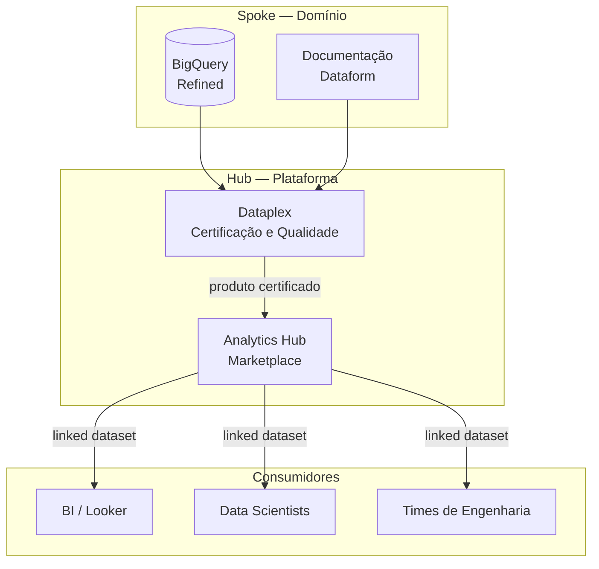

**Fluxo de publicação:**

1. **Domínio** finaliza o produto de dados no BigQuery (camada refined)
2. **Dataform** documenta linhagem, testes e metadados de negócio
3. **Dataplex** executa validações de qualidade e certifica o dataset
4. **Spoke** submete o produto para o Analytics Hub via processo padronizado
5. **Hub** revisa e publica no marketplace interno
6. **Consumidores** subscrevem ao produto via linked dataset — sem mover dados

> O linked dataset do Analytics Hub garante que o consumidor sempre veja os dados mais recentes do domínio, sem duplicação, e com o controle de acesso gerenciado centralmente pelo hub.

---

## Modelo de Governança

A governança é o coração do hub. Ela não é uma barreira — é um serviço que dá confiança aos consumidores.

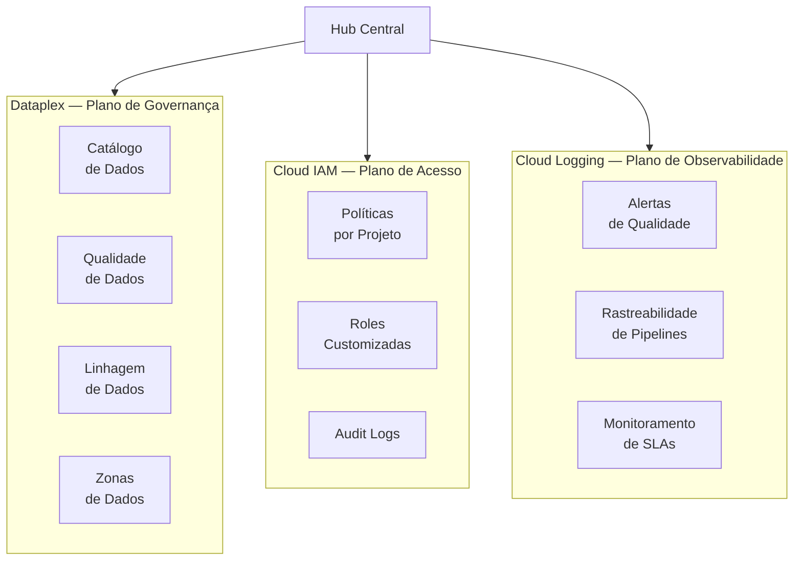

**Responsabilidades de governança:**

| Dimensão | Serviço | O que garante |
|---|---|---|
| **Descoberta** | Dataplex Catalog | Todo produto de dado é catalogado com metadados de negócio |
| **Qualidade** | Dataplex Data Quality | Regras de qualidade executadas automaticamente antes da publicação |
| **Linhagem** | Dataplex Lineage | Rastreabilidade de ponta a ponta: da fonte ao produto final |
| **Acesso** | Cloud IAM + Dataplex | Políticas centralizadas; nenhum dado é acessado sem autorização explícita |
| **Auditoria** | Cloud Logging | Todo acesso a dado é registrado e auditável |
| **SLA** | Cloud Logging + Alertas | Pipelines monitorados com alertas de atraso ou falha |

**Modelo de responsabilidade compartilhada:**

```
Hub (Plataforma)                    Spoke (Domínio)
─────────────────────────────────   ─────────────────────────────────
✅ Define padrões de qualidade       ✅ Implementa regras do domínio
✅ Provê infraestrutura de ingestão  ✅ Conhece e transforma seus dados
✅ Gerencia IAM centralizado         ✅ Define quem no domínio acessa
✅ Opera o marketplace (Sharing)     ✅ Publica e documenta produtos
✅ Monitora SLAs de pipelines        ✅ Garante SLAs do produto de dados
❌ Não define lógica de negócio      ❌ Não opera infraestrutura core
❌ Não é dono dos dados de domínio   ❌ Não publica sem certificação
```

---

## Modelo de Custos

Uma das vantagens mais estratégicas da arquitetura Hub-Spoke é a **segregação natural de custos** entre as equipes. A separação clara de responsabilidades entre Hub e Spokes se reflete diretamente na alocação de gastos na GCP, eliminando o problema clássico dos modelos centralizados onde o custo de dados era um "pool" opaco sem accountability por domínio.

**Princípio de alocação:**

| Camada | Responsável pelo custo | Justificativa |
|---|---|---|
| **Governança** (Dataplex + IAM + Logging) | Hub | Serviço compartilhado de plataforma, beneficia todos |
| **Orquestração** (Cloud Composer) | Hub | Infraestrutura central de scheduling |
| **Marketplace** (Analytics Hub) | Hub | Canal de publicação compartilhado |
| **Ingestão por fonte** | Spoke solicitante | Cada spoke paga pela ingestão das fontes que solicitou |
| **Transformação** (Dataform + BigQuery) | Spoke | Cada domínio paga pelo processamento das suas transformações |
| **Armazenamento do domínio** (BigQuery) | Spoke | Datasets e camadas (raw, trusted, refined) alocados por domínio |

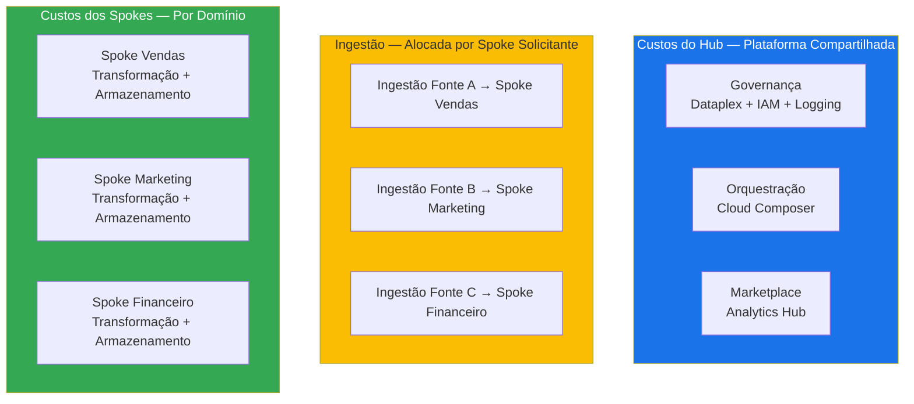

**Como a segregação funciona na prática:**

Utilizando **labels por projeto e por spoke** nos recursos GCP, é possível atribuir com precisão:

- O custo de cada pipeline de ingestão ao spoke que o solicitou (via label `spoke=vendas`, por exemplo)
- O custo de processamento BigQuery por domínio
- O custo de armazenamento por camada e por domínio

Isso significa que o chargeback financeiro entre as equipes é baseado em dados reais de consumo, não em estimativas ou rateios arbitrários.

> O Hub paga pela infraestrutura que beneficia a todos — governança, orquestração e marketplace. Cada spoke paga exatamente pelo que consome em ingestão, transformação e armazenamento. Quanto mais eficiente o domínio for nas suas transformações, menor será o seu custo.

---

## Migração Incremental

Adotar a arquitetura Hub-Spoke **não exige uma migração big-bang**. Não é necessário parar tudo, redesenhar sistemas e migrar de uma vez. A transição pode — e deve — ser feita de forma incremental, domínio por domínio, reduzindo risco e gerando valor desde as primeiras semanas.

**Princípio da migração:**
> Cada domínio que adere ao hub-spoke gera valor imediato. Domínios ainda não migrados continuam funcionando como antes, sem bloqueio.

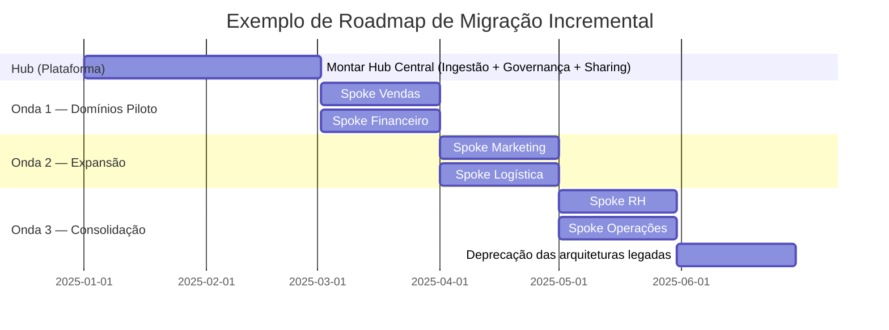

**Como funciona na prática:**

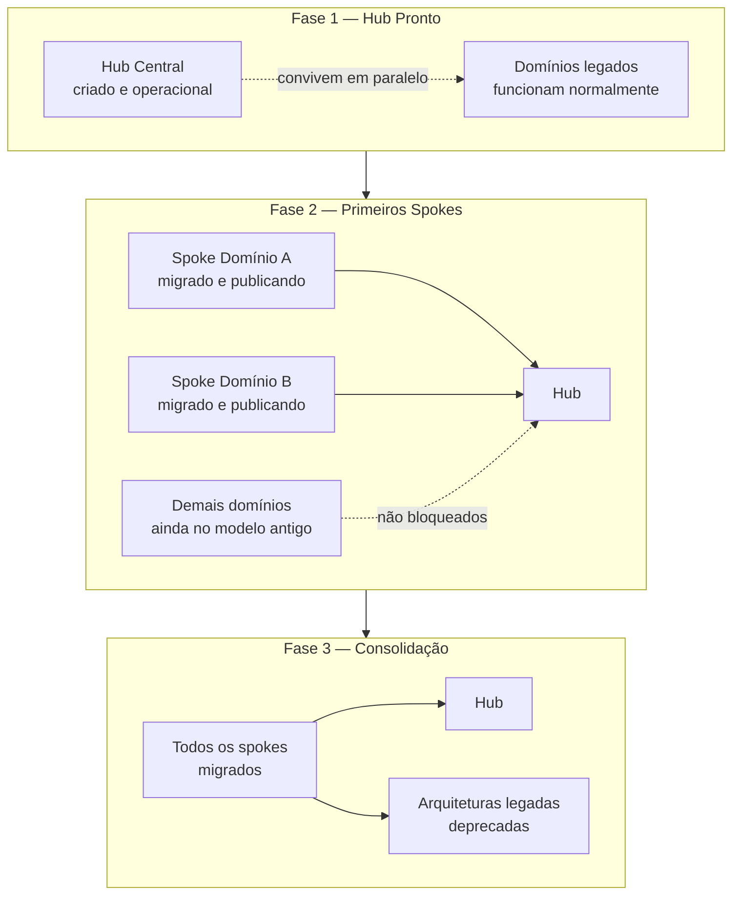

**Critérios para priorizar quais domínios migrar primeiro:**

| Critério | Domínio ideal para onda 1 |
|---|---|
| **Impacto** | Dados muito consumidos por outros times — gera visibilidade imediata |
| **Complexidade** | Domínios com pipelines simples — reduz risco do piloto |
| **Engajamento** | Times que já querem mudar — facilita aprendizado e documentação do padrão |
| **Dívida técnica** | Domínios com mais problemas de qualidade — o hub resolve e gera credibilidade |

**O que a migração incremental evita:**
- Risco de paralisação operacional por mudança simultânea
- Necessidade de reescrever tudo antes de gerar valor
- Resistência organizacional por mudança abrupta
- Perda de conhecimento acumulado nos sistemas legados

> A migração incremental não é uma concessão — é uma estratégia. Cada spoke migrado é uma prova de conceito que reduz o custo e o risco dos próximos.

---

## Benefícios

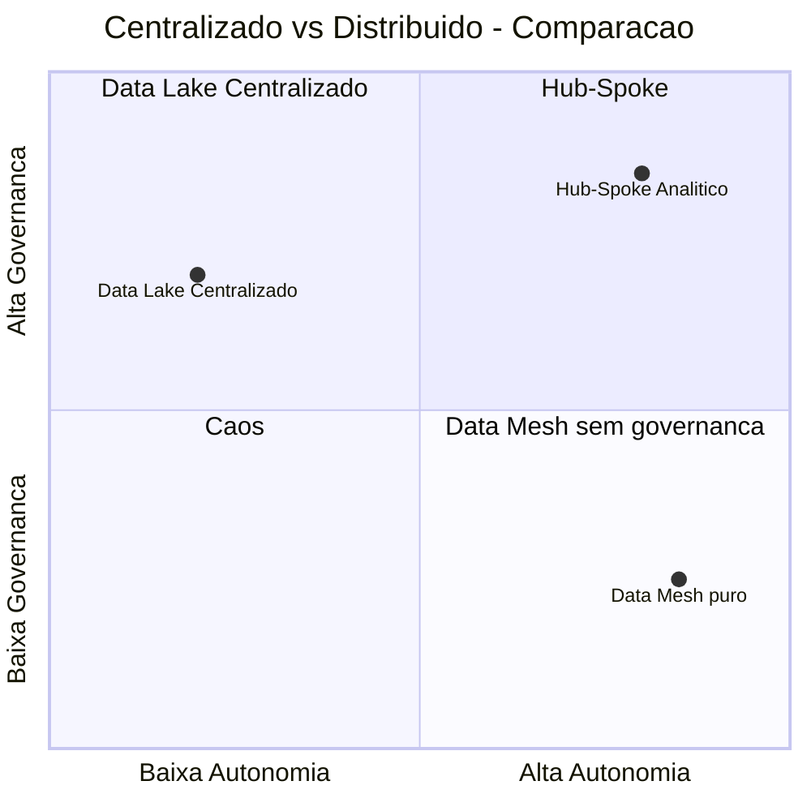

| Benefício | Como o Hub-Spoke entrega |
|---|---|
| **Descoberta de dados** | Catálogo centralizado no Dataplex — um lugar para encontrar tudo |
| **Qualidade garantida** | Dataplex Data Quality como portão de entrada para o marketplace |
| **Autonomia de domínio** | Spokes transformam e publicam sem depender da equipe central |
| **Governança unificada** | IAM e políticas gerenciadas pelo hub, aplicadas a todos |
| **Custo controlado e segregado** | Hub paga pela plataforma compartilhada; spokes pagam pela sua transformação e ingestão — chargeback baseado em consumo real |
| **Rastreabilidade** | Linhagem de ponta a ponta registrada pelo Dataform + Dataplex |
| **Escalabilidade** | Novos domínios (spokes) aderem ao padrão sem redesenhar o hub |
| **Segurança** | Audit logs centralizados; nenhum acesso sem registro |

---

*Arquitetura definida para o ambiente Google Cloud. Versão inicial — exemplos de implementação a serem adicionados.*
