# Arquitetura Hub-Spoke Analítica Multi-Cloud (AWS + Google Cloud)

## Sumário

1. [Contexto e Motivação](#contexto-e-motivação)
2. [Por Que Multi-Cloud](#por-que-multi-cloud)
3. [Arquitetura Hub-Spoke Multi-Cloud](#arquitetura-hub-spoke-multi-cloud)
   - [Visão Geral](#visão-geral)
   - [Camada de Ingestão e Raw (AWS)](#camada-de-ingestão-e-raw-aws)
   - [Camada de Transformação — Spokes](#camada-de-transformação--spokes)
   - [Camada de Serving / Gold (Google Cloud)](#camada-de-serving--gold-google-cloud)
4. [Apache Iceberg como Formato Universal](#apache-iceberg-como-formato-universal)
5. [BigQuery Cross-Cloud Lakehouse](#bigquery-cross-cloud-lakehouse)
6. [Stack Tecnológica Multi-Cloud](#stack-tecnológica-multi-cloud)
7. [Fluxo de Dados End-to-End](#fluxo-de-dados-end-to-end)
8. [Opções de Spokes](#opções-de-spokes)
   - [Databricks na AWS](#databricks-na-aws)
   - [AWS Glue](#aws-glue)
   - [BigQuery no Google Cloud](#bigquery-no-google-cloud)
9. [Governança Multi-Cloud](#governança-multi-cloud)
10. [Modelo de Custos](#modelo-de-custos)
11. [Migração Incremental](#migração-incremental)
12. [Benefícios](#benefícios)

---

## Contexto e Motivação

A arquitetura [Hub-Spoke Analítica](arquitetura-hubspoke.md) resolve o dilema entre centralização e autonomia no mundo de dados. Mas a realidade de muitas empresas é multi-cloud: **os sistemas transacionais rodam na AWS** — bancos de dados RDS, Aurora, DynamoDB, aplicações em ECS/EKS — enquanto a **camada analítica e de BI já está consolidada no Google Cloud** com BigQuery e Looker.

Mover dados transacionais para o Google Cloud apenas para ingerir gera latência, custo de egress e complexidade desnecessária. A abordagem correta é **ingerir onde os dados nascem** (AWS) e **servir onde os dados são consumidos** (Google Cloud).

Esta arquitetura estende o modelo Hub-Spoke original para operar nativamente em dois clouds, com **Apache Iceberg** como formato universal e **BigQuery Cross-Cloud Lakehouse** como tecnologia que elimina a necessidade de replicação de dados entre clouds.

---

## Por Que Multi-Cloud

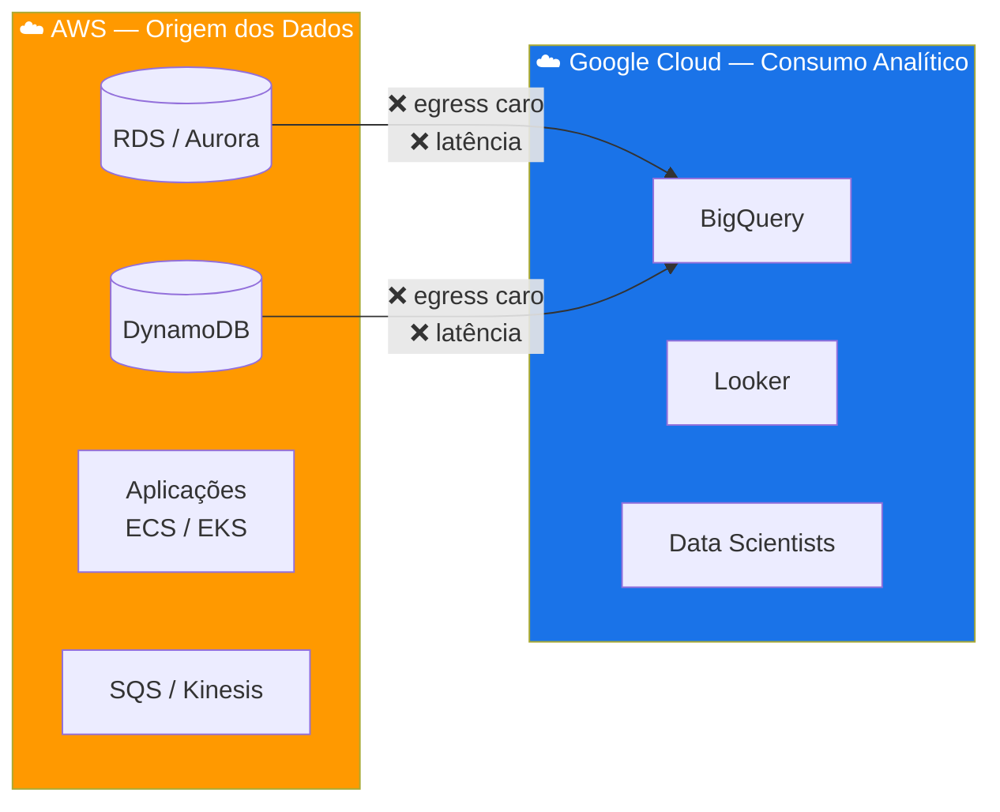

**O problema do modelo single-cloud para empresas com infraestrutura transacional na AWS:**

| Problema | Impacto |
|---|---|
| **Egress de dados AWS → GCP** | Custo significativo de transferência entre clouds |
| **Latência de ingestão** | Dados transacionais precisam cruzar a internet antes de serem processados |
| **Duplicação de dados** | Cópias completas entre S3 e GCS geram custo de armazenamento dobrado |
| **Complexidade operacional** | Pipelines de sincronização entre clouds são frágeis e caros de manter |

**A solução: ingerir na AWS, transformar onde fizer sentido, servir no Google Cloud.**

---

## Arquitetura Hub-Spoke Multi-Cloud

### Visão Geral

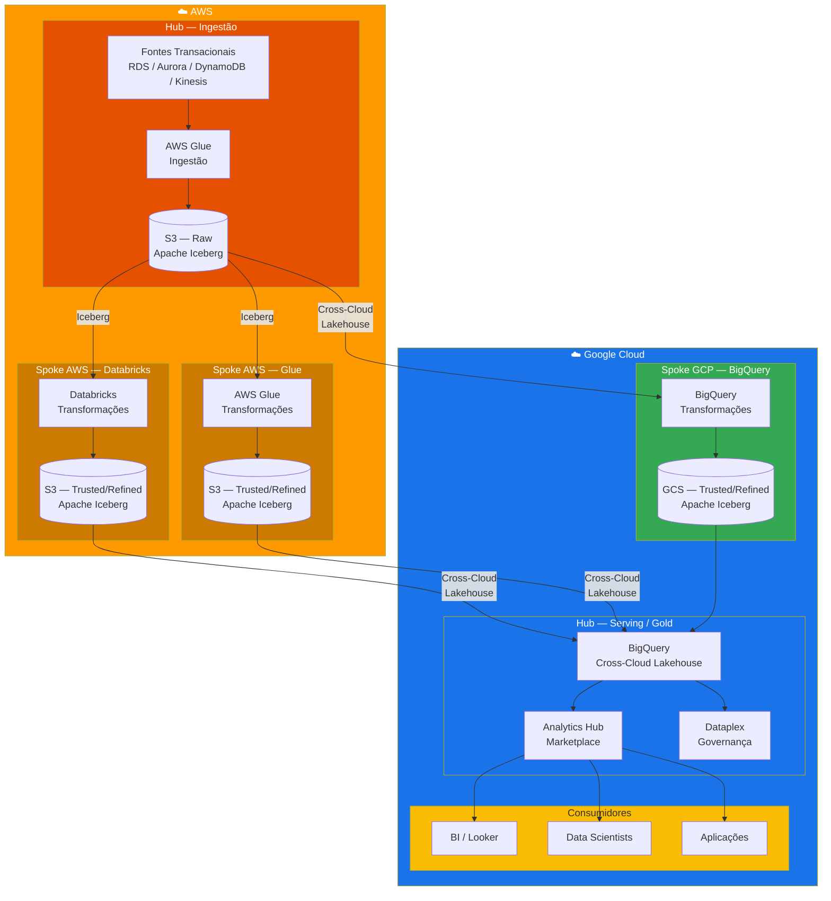

**Princípio central:**
> Ingerir onde os dados nascem. Transformar onde o domínio opera. Servir onde o consumo analítico acontece.

---

### Camada de Ingestão e Raw (AWS)

A camada de ingestão reside na AWS porque é lá que os sistemas transacionais estão. Não há motivo para mover dados brutos para outro cloud antes de processá-los.

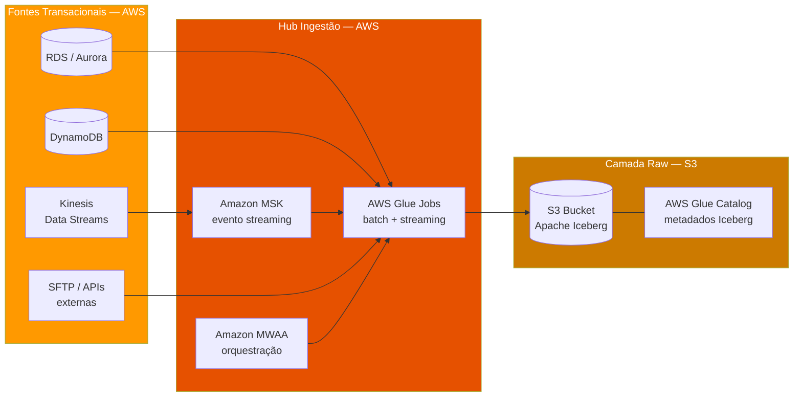

**Responsabilidades da camada de ingestão (AWS):**

| Componente | Serviço AWS | Responsabilidade |
|---|---|---|
| **Ingestão batch** | AWS Glue | CDC e full-load de bancos relacionais para Iceberg no S3 |
| **Ingestão streaming** | Amazon MSK + Glue Streaming | Eventos em tempo real escritos como Iceberg no S3 |
| **Orquestração** | Amazon MWAA (Airflow) | Scheduling e dependências entre jobs de ingestão |
| **Catálogo** | AWS Glue Data Catalog | Registro de tabelas Iceberg — metadados acessíveis por Databricks, Glue e BigQuery |
| **Armazenamento** | Amazon S3 | Dados brutos em formato Apache Iceberg, imutáveis |

> Todos os dados brutos são escritos em **Apache Iceberg** no S3. Isso garante que qualquer spoke — Databricks, Glue ou BigQuery — possa ler os mesmos dados sem conversão.

---

### Camada de Transformação — Spokes

Os spokes operam na camada de transformação. Cada domínio de negócio escolhe a engine que melhor se adapta às suas necessidades — Databricks, Glue ou BigQuery — mas todos leem e escrevem dados em **Apache Iceberg**.

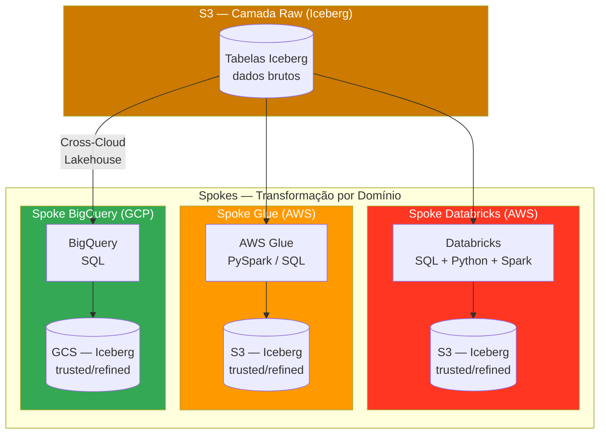

Detalhes de cada opção de spoke na seção [Opções de Spokes](#opções-de-spokes).

---

### Camada de Serving / Gold (Google Cloud)

A camada de serving é **exclusivamente no BigQuery**, no Google Cloud. É aqui que os produtos de dados certificados ficam disponíveis para consumo analítico — BI, data science, aplicações.

O **BigQuery Cross-Cloud Lakehouse** é a tecnologia que torna isso possível sem replicação: BigQuery acessa tabelas Iceberg no S3 diretamente, como se fossem tabelas nativas.

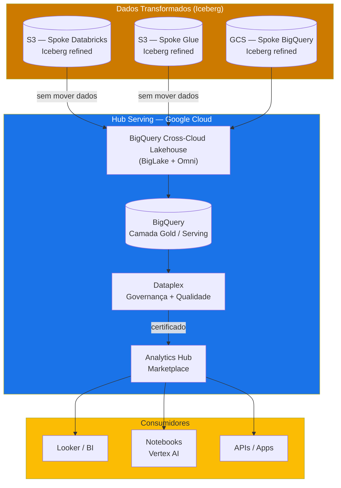

> O BigQuery Cross-Cloud Lakehouse permite que dados Iceberg no S3 sejam consultados com performance nativa do BigQuery — sem copiar, sem sincronizar, sem pipelines de replicação.

---

## Apache Iceberg como Formato Universal

Na arquitetura multi-cloud, o formato dos dados é a decisão mais importante. **Apache Iceberg** é o formato universal que garante interoperabilidade total entre AWS e Google Cloud, entre S3 e GCS, e entre todas as engines de processamento.

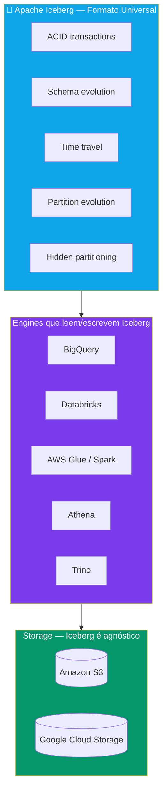

**Por que Iceberg e não Parquet puro, Delta Lake ou Hudi?**

| Critério | Apache Iceberg | Delta Lake | Parquet puro |
|---|---|---|---|
| **Suporte BigQuery nativo** | Sim — Cross-Cloud Lakehouse | Limitado | Sim, mas sem ACID |
| **Suporte Databricks** | Sim (UniForm) | Nativo | Sim |
| **Suporte AWS Glue** | Sim | Sim | Sim |
| **Open standard** | Sim — Apache Foundation | Controlado pela Databricks | Sim |
| **ACID transactions** | Sim | Sim | Não |
| **Time travel** | Sim | Sim | Não |
| **Schema evolution** | Sim | Sim | Não |
| **Partition evolution** | Sim | Não | Não |
| **Vendor lock-in** | Nenhum | Risco Databricks | Nenhum |

> Apache Iceberg é open standard, suportado nativamente por BigQuery, Databricks, Glue, Athena e Trino. É o único formato que garante **zero vendor lock-in** com suporte completo em ambos os clouds.

**Catálogos Iceberg na arquitetura:**

| Catálogo | Onde opera | Responsabilidade |
|---|---|---|
| **AWS Glue Data Catalog** | AWS | Registra tabelas Iceberg no S3 — usado por Glue, Databricks e Athena |
| **BigLake Metastore** | Google Cloud | Registra tabelas Iceberg para BigQuery — sincroniza com Glue Catalog |
| **Unity Catalog (Databricks)** | AWS | Catálogo do Databricks — lê Iceberg via Glue Catalog ou diretamente |

---

## BigQuery Cross-Cloud Lakehouse

O **BigQuery Cross-Cloud Lakehouse** é a funcionalidade que viabiliza toda a arquitetura multi-cloud. Ele permite que o BigQuery acesse dados armazenados em **Amazon S3** como se fossem dados nativos do BigQuery — sem mover, sem copiar, sem sincronizar.

> Referência: [About Cross-Cloud Lakehouse](https://docs.cloud.google.com/lakehouse/docs/about-cross-cloud-lakehouse)

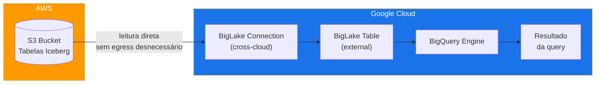

**Como funciona:**

1. **BigLake Connection** — conexão configurada no BigQuery que aponta para um bucket S3 usando credenciais AWS (IAM Role)
2. **BigLake Table** — tabela externa no BigQuery que referencia tabelas Iceberg no S3 via a connection
3. **Query execution** — BigQuery executa queries distribuídas, lendo os dados diretamente do S3 com pushdown de filtros e predicados
4. **Otimizações** — BigQuery aplica caching, materialização seletiva e acceleration automática para queries frequentes

**Capacidades do Cross-Cloud Lakehouse:**

| Capacidade | Descrição |
|---|---|
| **Leitura de Iceberg no S3** | Queries SQL padrão BigQuery sobre tabelas Iceberg armazenadas no S3 |
| **Leitura de Iceberg no GCS** | Tabelas Iceberg no GCS também acessíveis via BigLake |
| **Pushdown de predicados** | Filtros aplicados na origem — não transfere dados desnecessários |
| **Suporte a metadados Iceberg** | Schema evolution, partitioning, snapshots — tudo respeitado pelo BigQuery |
| **Governança unificada** | Dataplex aplica políticas de qualidade e acesso sobre tabelas cross-cloud |
| **Performance otimizada** | BigQuery Omni processa dados localmente na AWS quando necessário |

**Exemplo de criação de tabela cross-cloud:**

```sql
-- 1. Criar a conexão cross-cloud para AWS
CREATE EXTERNAL CONNECTION `project.region.aws_connection`
  OPTIONS (
    connection_type = 'AWS',
    aws_cross_account_role.iam_role_id = 'arn:aws:iam::123456789:role/bigquery-cross-cloud'
  );

-- 2. Criar tabela BigLake apontando para Iceberg no S3
CREATE EXTERNAL TABLE `project.dataset.vendas_refined`
  WITH CONNECTION `project.region.aws_connection`
  OPTIONS (
    format = 'ICEBERG',
    uris = ['s3://bucket-spoke-vendas/refined/vendas/'],
    metadata_cache_mode = 'AUTOMATIC'
  );

-- 3. Consultar como tabela nativa BigQuery
SELECT
  data_venda,
  produto,
  SUM(valor) AS total
FROM `project.dataset.vendas_refined`
WHERE data_venda >= '2025-01-01'
GROUP BY data_venda, produto;
```

> O consumidor final não precisa saber que os dados estão no S3. Para ele, é uma tabela BigQuery como qualquer outra. A complexidade multi-cloud é abstraída pela plataforma.

---

## Stack Tecnológica Multi-Cloud

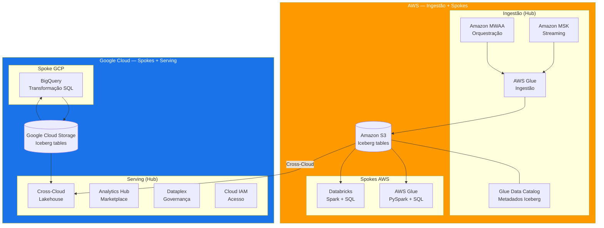

| Serviço | Cloud | Papel na Arquitetura |
|---|---|---|
| **AWS Glue (Ingestão)** | AWS | CDC e full-load de fontes transacionais para Iceberg no S3 |
| **Amazon MSK** | AWS | Ingestão de eventos em streaming |
| **Amazon MWAA** | AWS | Orquestração de DAGs de ingestão |
| **AWS Glue Data Catalog** | AWS | Catálogo de tabelas Iceberg — metadados compartilhados entre engines |
| **Amazon S3** | AWS | Armazenamento de dados em formato Iceberg (raw, trusted, refined) |
| **Databricks** | AWS | Spoke de transformação — Spark + SQL sobre Iceberg |
| **AWS Glue (Transformação)** | AWS | Spoke de transformação — PySpark serverless sobre Iceberg |
| **BigQuery** | GCP | Spoke de transformação + engine da camada de serving |
| **Cross-Cloud Lakehouse** | GCP | Acesso nativo do BigQuery a tabelas Iceberg no S3 |
| **Google Cloud Storage** | GCP | Armazenamento de dados Iceberg para spokes GCP |
| **Analytics Hub** | GCP | Marketplace interno de produtos de dados |
| **Dataplex** | GCP | Governança unificada — catálogo, qualidade, linhagem |
| **Cloud IAM** | GCP | Controle de acesso centralizado na camada de serving |

---

## Fluxo de Dados End-to-End

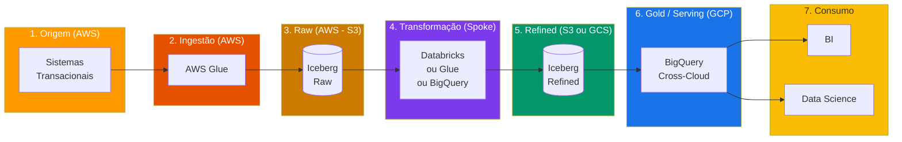

**Camadas de dados na arquitetura multi-cloud:**

| Camada | Nome | Storage | Formato | Responsável |
|---|---|---|---|---|
| `raw` | Zona Bruta | S3 (AWS) | Apache Iceberg | Hub — Ingestão |
| `trusted` | Zona Confiável | S3 ou GCS | Apache Iceberg | Spoke |
| `refined` | Zona Refinada | S3 ou GCS | Apache Iceberg | Spoke |
| `gold` / `serving` | Zona de Consumo | BigQuery (GCP) | BigQuery nativo ou BigLake (Iceberg) | Hub — Serving |

> Todas as camadas usam Apache Iceberg. Os dados podem residir no S3 ou no GCS dependendo de onde o spoke opera. A camada gold é sempre servida pelo BigQuery — lendo de qualquer storage via Cross-Cloud Lakehouse.

---

## Opções de Spokes

Cada domínio de negócio escolhe a engine de transformação que melhor atende suas necessidades. Todas operam sobre Apache Iceberg, garantindo interoperabilidade total.

### Databricks na AWS

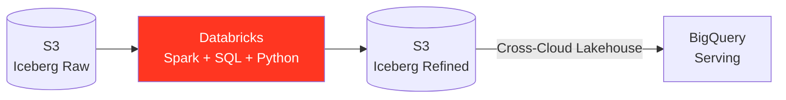

| Aspecto | Detalhe |
|---|---|
| **Quando usar** | Domínios com transformações complexas, ML pipelines, processamento pesado em Spark |
| **Linguagens** | SQL, Python, Scala |
| **Iceberg** | Suporte nativo via Unity Catalog ou Glue Catalog |
| **Vantagens** | Notebooks colaborativos, MLflow integrado, Delta UniForm para compatibilidade |
| **Custo** | Licenciamento Databricks + compute EC2 |

### AWS Glue

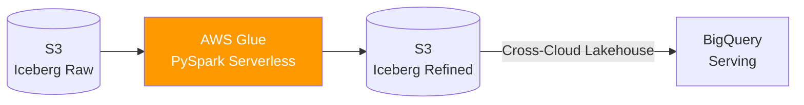

| Aspecto | Detalhe |
|---|---|
| **Quando usar** | Domínios com transformações batch simples a moderadas, equipes familiarizadas com PySpark |
| **Linguagens** | PySpark, Python Shell |
| **Iceberg** | Suporte nativo via Glue Data Catalog |
| **Vantagens** | Serverless, sem cluster para gerenciar, integração nativa com Glue Catalog e S3 |
| **Custo** | Pay-per-use — DPUs consumidas durante execução |

### BigQuery no Google Cloud

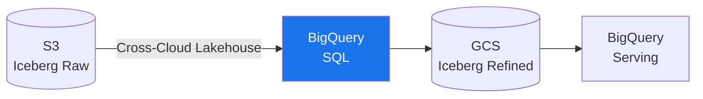

| Aspecto | Detalhe |
|---|---|
| **Quando usar** | Domínios com transformações SQL-first, equipes já familiarizadas com BigQuery |
| **Linguagens** | SQL (Dataform) |
| **Iceberg** | Lê Iceberg do S3 via Cross-Cloud Lakehouse, escreve Iceberg no GCS via BigLake |
| **Vantagens** | Engine serverless, Dataform para versionamento SQL, governança Dataplex integrada |
| **Custo** | On-demand ou slots reservados BigQuery |

**Comparativo rápido:**

| Critério | Databricks | AWS Glue | BigQuery |
|---|---|---|---|
| **Complexidade de transformações** | Alta | Média | Média-Alta (SQL) |
| **ML integrado** | Sim (MLflow) | Não | Sim (Vertex AI) |
| **Serverless** | Serverless Compute | Sim | Sim |
| **Custo operacional** | Alto | Baixo | Médio |
| **Curva de aprendizado** | Média | Baixa | Baixa |
| **Onde os dados ficam** | S3 (Iceberg) | S3 (Iceberg) | GCS (Iceberg) |

> Não existe spoke "melhor" — existe o spoke que se adapta ao domínio. Um domínio de Data Science pode preferir Databricks por causa do MLflow. Um domínio de finanças pode preferir BigQuery pela familiaridade com SQL e integração com Looker. Um domínio com transformações simples pode escolher Glue pelo custo mínimo.

---

## Governança Multi-Cloud

A governança na arquitetura multi-cloud é centralizada no **Google Cloud**, na camada de serving. O Dataplex governa os produtos de dados publicados — independente de onde foram transformados ou armazenados.

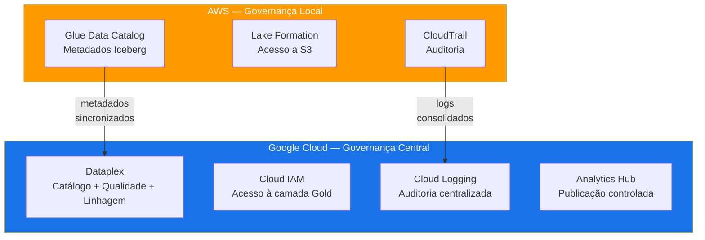

**Modelo de responsabilidade multi-cloud:**

```
AWS (Ingestão + Spokes)                 Google Cloud (Serving + Governança)
────────────────────────────────────    ────────────────────────────────────
✅ Glue Catalog para tabelas Iceberg    ✅ Dataplex para governança unificada
✅ Lake Formation para acesso ao S3     ✅ Cloud IAM para acesso à camada Gold
✅ CloudTrail para auditoria local      ✅ Cloud Logging para auditoria central
✅ Spokes operam com autonomia          ✅ Analytics Hub como marketplace único
❌ Não publica produtos de dados        ❌ Não opera ingestão de fontes AWS
❌ Não define padrões de consumo        ❌ Não gerencia storage no S3
```

> A governança de publicação e consumo é sempre no Google Cloud. A governança operacional de ingestão e transformação na AWS é local e complementar.

---

## Modelo de Custos

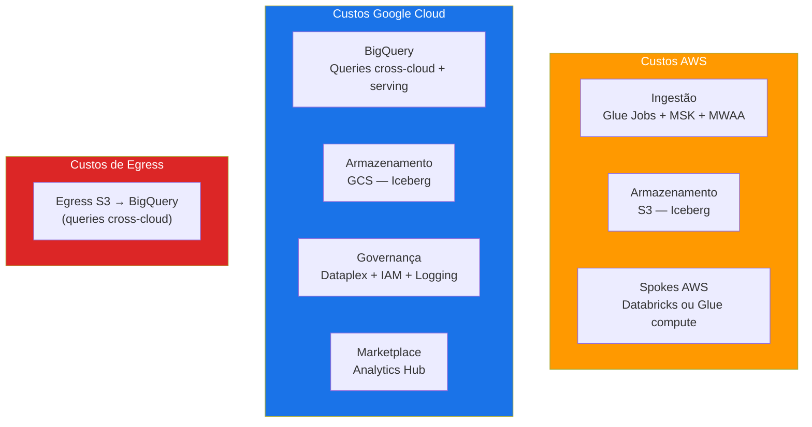

**Alocação de custos:**

| Componente | Quem paga | Cloud | Notas |
|---|---|---|---|
| **Ingestão** | Spoke solicitante | AWS | Glue DPUs proporcionais ao volume ingerido |
| **Armazenamento Raw (S3)** | Hub | AWS | Custo compartilhado — dados brutos servem todos os spokes |
| **Armazenamento Spoke (S3)** | Spoke | AWS | Cada spoke paga por suas tabelas trusted/refined |
| **Armazenamento Spoke (GCS)** | Spoke | GCP | Spokes BigQuery armazenam no GCS |
| **Compute Databricks** | Spoke | AWS | Licenciamento + EC2 por domínio |
| **Compute Glue** | Spoke | AWS | DPUs por job, pay-per-use |
| **Compute BigQuery** | Spoke + Hub | GCP | Queries de transformação (spoke) + queries de serving (hub) |
| **Egress S3 → BigQuery** | Hub | AWS/GCP | Custo de transfer para queries cross-cloud |
| **Governança** | Hub | GCP | Dataplex, IAM, Logging — serviço compartilhado |
| **Analytics Hub** | Hub | GCP | Marketplace — custo compartilhado |

**Otimização de egress — a principal preocupação de custo multi-cloud:**

| Estratégia | Impacto |
|---|---|
| **Pushdown de predicados** | BigQuery envia filtros para S3 — só transfere dados necessários |
| **Materialização seletiva** | Tabelas muito consultadas podem ser materializadas no BigQuery para evitar egress recorrente |
| **Cache automático** | BigQuery armazena resultados em cache — queries repetidas não geram egress |
| **Partitioning Iceberg** | Partições bem definidas reduzem volume de scan e egress |
| **BI Engine** | Aceleração in-memory para dashboards de alta frequência |

> O egress cross-cloud é o custo mais sensível da arquitetura multi-cloud. A combinação de pushdown de predicados, materialização seletiva e partitioning Iceberg mantém esse custo sob controle. Para datasets com padrão de consumo previsível e alto volume, materializar no BigQuery pode ser mais econômico que pagar egress repetido.

---

## Migração Incremental

A migração para a arquitetura multi-cloud segue o mesmo princípio do modelo single-cloud: **incremental, domínio por domínio**, sem big-bang.

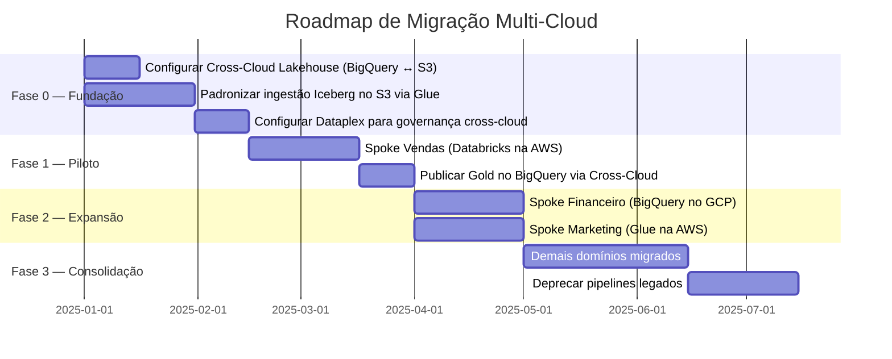

**Fases da migração:**

| Fase | O que acontece | Resultado |
|---|---|---|
| **0 — Fundação** | Configura Cross-Cloud Lakehouse, padroniza ingestão Iceberg, monta governança Dataplex | Infraestrutura multi-cloud pronta |
| **1 — Piloto** | Um spoke migrado end-to-end, publicando Gold no BigQuery | Prova de conceito validada |
| **2 — Expansão** | Mais spokes migrados, potencialmente usando engines diferentes | Padrão consolidado, aprendizados aplicados |
| **3 — Consolidação** | Todos os domínios migrados, pipelines legados deprecados | Arquitetura multi-cloud em produção |

> A fundação (Cross-Cloud Lakehouse + Iceberg + Dataplex) é o investimento inicial. Uma vez pronta, cada spoke adicional é incremental e de baixo risco.

---

## Benefícios

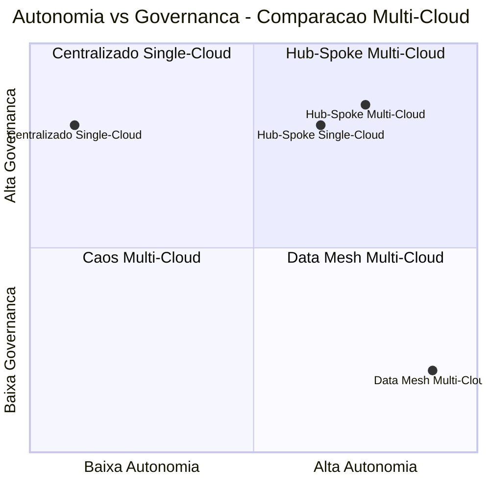

| Benefício | Como a arquitetura multi-cloud entrega |
|---|---|
| **Ingestão onde os dados nascem** | Fontes AWS ingeridas na AWS — sem egress desnecessário na ingestão |
| **Serving unificado no BigQuery** | Toda a camada Gold em BigQuery — BI, Data Science e aplicações num único ponto |
| **Zero replicação obrigatória** | Cross-Cloud Lakehouse lê Iceberg no S3 diretamente — sem pipelines de sincronização |
| **Formato aberto (Iceberg)** | Sem vendor lock-in — qualquer engine lê e escreve os mesmos dados |
| **Escolha de engine por domínio** | Cada spoke escolhe Databricks, Glue ou BigQuery conforme sua necessidade |
| **Governança unificada** | Dataplex governa dados independente de onde estão armazenados |
| **Custo segregado** | Cada spoke paga pelo que consome, com visibilidade por cloud e por domínio |
| **Migração incremental** | Domínios migram um a um, sem big-bang, com valor imediato |
| **Autonomia de domínio mantida** | Spokes operam com liberdade de engine e linguagem, dentro dos padrões da plataforma |
| **Escalabilidade multi-cloud** | Novos domínios aderem sem redesenhar a arquitetura — funciona igual no 2º e no 20º spoke |

---

*Arquitetura definida para ambientes AWS + Google Cloud. Formato de dados: Apache Iceberg. Camada de serving: BigQuery com Cross-Cloud Lakehouse.*
